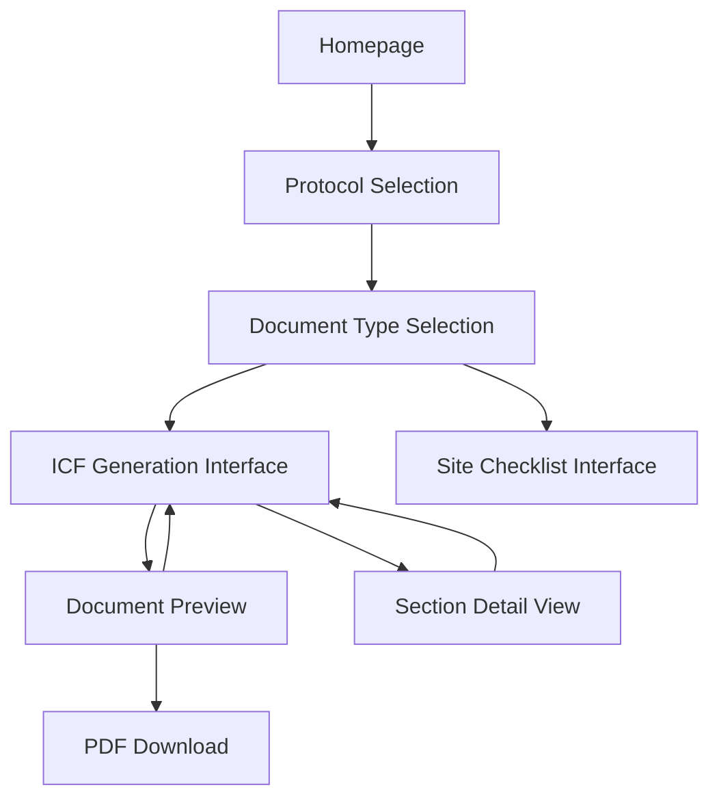
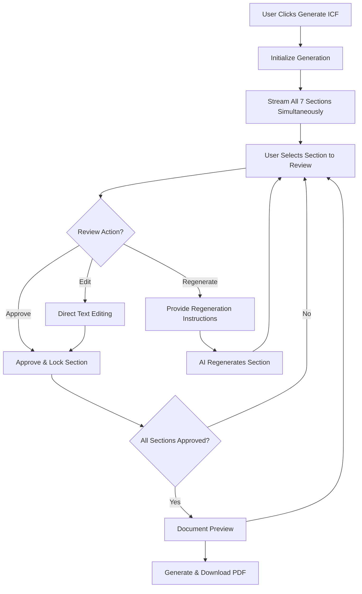

# Epic 2: AI Document Generation - UI/UX Specification

## Introduction

This specification defines the user experience goals, information architecture, user flows, and visual design specifications for Epic 2's AI-powered Informed Consent Form (ICF) generation system. The interface must elegantly handle streaming AI content generation while providing comprehensive human-in-the-loop review capabilities for regulatory compliance.

- **Link to Primary Design Files:** [To be created in Figma/design tool]
- **Link to Deployed Storybook / Design System:** [To be implemented]

## Overall UX Goals & Principles

### Target User Personas

**Primary: Clinical Trial Administrator**
- Role: Manages protocol documentation and regulatory compliance
- Goals: Generate high-quality, regulation-ready documents efficiently
- Context: Works in highly regulated environment requiring human oversight
- Technical Comfort: Moderate to high, familiar with clinical trial software

**Secondary: Principal Investigator**
- Role: Oversees clinical trial operations and final document approval
- Goals: Review and approve generated documents for accuracy and compliance
- Context: Limited time, needs clear approval workflows
- Technical Comfort: Moderate, focuses on content quality over technical features

### Usability Goals

- **Immediate Feedback:** Users see content generation progress in real-time
- **Efficient Review:** Section-based workflow allows non-linear, flexible review
- **Clear Status Indicators:** Always visible progress and approval state
- **Error Prevention:** Clear guidance prevents accidental actions or missed steps
- **Regulatory Confidence:** Interface reinforces human oversight and control

### Design Principles

1. **Transparency Over Automation:** Always show what AI is doing and why
2. **Human Authority:** User maintains clear control over all content decisions
3. **Progressive Disclosure:** Reveal complexity only when needed
4. **Status Clarity:** Never leave users wondering about current state
5. **Efficient Workflows:** Minimize clicks and cognitive load for common actions

## Information Architecture (IA)

### Site Map / Screen Inventory

### Navigation Structure

**Primary Navigation:**
- Breadcrumb trail: Home > Protocol > Document Type > Generation
- Protocol context bar (always visible during generation)
- Progress indicator (section completion status)

**Secondary Navigation:**
- Section jump navigation (sidebar or tabs)
- Bulk actions toolbar
- Document actions (preview, download, restart)

## User Flows

### ICF Generation Workflow

**Goal:** Generate a complete, regulation-ready ICF with human approval for each section

**Steps:**

### Section Review Micro-Flow

**Goal:** Efficiently review and approve individual ICF sections

**Steps:**
1. **Section Selection:** Click on section title or content area
2. **Review Mode Activation:** Section highlights, actions panel appears
3. **Content Assessment:** User reads generated content
4. **Action Decision:** Choose approve, edit, or regenerate
5. **Action Execution:** Perform selected action
6. **Status Update:** Visual feedback confirms action completion

### Bulk Actions Flow

**Goal:** Rapidly approve multiple sections for testing/experimentation

**Steps:**
1. **Bulk Action Trigger:** Click "Approve All" button
2. **Confirmation Dialog:** "Approve all 7 sections? This will lock all content."
3. **Bulk Processing:** All sections marked as approved simultaneously
4. **Status Update:** All sections show approved/locked state
5. **Document Completion:** Automatic transition to preview mode

## Wireframes & Mockups

### ICF Generation Interface (Primary Screen)

**Layout Structure:**
- **Header Area:** Protocol context, progress indicator, bulk actions
- **Main Content:** 7 section containers in vertical scroll layout
- **Sidebar:** Section navigation, status overview, document actions
- **Footer:** Action buttons (Preview Document, Continue Later)

**Section Container Design:**
- **Section Title:** Clear hierarchy with section number and name
- **Status Indicator:** Visual icon and color for generating/ready/approved/locked
- **Content Area:** Text box with streaming content, expandable height
- **Action Panel:** Appears on section selection, contains approve/edit/regenerate controls

### Section Review Interface (Focus Mode)

**Layout Structure:**
- **Focused Section:** Expanded view with enhanced text editing capabilities
- **Action Panel:** Prominent placement of approve/edit/regenerate controls
- **Context Panel:** Protocol reference information, section requirements
- **Navigation:** Easy return to overview, jump to other sections

### Document Preview Interface

**Layout Structure:**
- **Document View:** Full ICF document with professional formatting
- **Actions Toolbar:** Continue revisions, download PDF, print preview
- **Metadata Panel:** Generation timestamp, protocol information, approval status
- **Navigation:** Section jump links, scroll progress indicator

## Component Library / Design System Reference

### Core Components Required

**StreamingTextBox**
- Real-time content population with typing animation
- Dynamic height adjustment as content streams
- Loading states with progress indicators
- Read-only vs. editable states

**SectionStatusIndicator**
- Visual states: generating, ready, approved, locked, error
- Color coding with accessibility-compliant contrast
- Icon system for quick status recognition
- Animation for state transitions

**ActionPanel**
- Three-button layout for approve/edit/regenerate
- Context-sensitive button states and availability
- Confirmation dialogs for destructive actions
- Keyboard navigation support

**ProgressTracker**
- Section completion overview
- Visual progress bar for overall completion
- Individual section status indicators
- Bulk action status feedback

## Branding & Style Guide Reference

### Color Palette
- **Primary Blue:** #2563EB (trust, professionalism)
- **Success Green:** #10B981 (approved, completed)
- **Warning Orange:** #F59E0B (needs attention, in progress)
- **Error Red:** #EF4444 (errors, critical actions)
- **Neutral Gray:** #6B7280 (supporting text, borders)
- **Background:** #F9FAFB (clean, medical aesthetic)

### Typography
- **Headings:** Inter, Bold, 24px/20px/16px hierarchy
- **Body Text:** Inter, Regular, 14px (readable in clinical settings)
- **Section Titles:** Inter, Semi-bold, 18px
- **Status Text:** Inter, Medium, 12px
- **Monospace:** JetBrains Mono (for technical content)

### Iconography
- **Status Icons:** Simple, medical-appropriate icon set
- **Action Icons:** Standard UI patterns (edit, approve, regenerate)
- **Progress Icons:** Clear completion/pending indicators
- **Medical Context:** Subtle clinical trial imagery where appropriate

### Spacing & Grid
- **Base Unit:** 8px grid system
- **Section Spacing:** 24px between sections
- **Content Padding:** 16px internal padding
- **Action Spacing:** 12px between action buttons
- **Responsive Breakpoints:** 768px (tablet), 1024px (desktop)

## Accessibility (AX) Requirements

### Target Compliance
WCAG 2.1 AA compliance with particular attention to clinical/regulatory environments

### Specific Requirements

**Keyboard Navigation:**
- Tab order follows logical reading flow
- All interactive elements accessible via keyboard
- Section jump navigation with arrow keys
- Bulk actions accessible via keyboard shortcuts

**Screen Reader Support:**
- Section status announcements as content streams
- Action confirmations and result feedback
- Progress updates for bulk operations
- Clear labeling of all form elements and buttons

**Visual Accessibility:**
- High contrast color scheme (4.5:1 minimum)
- Status indicators use color + shape + text
- Font size minimum 14px for body text
- Clear focus indicators for all interactive elements

**Motor Accessibility:**
- Large click targets (44px minimum)
- Generous spacing between interactive elements
- Sticky positioning for critical actions
- Undo functionality for accidental actions

## Responsiveness

### Breakpoints
- **Mobile:** 320px - 767px (limited mobile support for complex workflow)
- **Tablet:** 768px - 1023px (primary mobile experience)
- **Desktop:** 1024px+ (optimal experience)

### Adaptation Strategy

**Desktop (1024px+):**
- Full three-column layout (navigation, content, actions)
- All sections visible simultaneously
- Sidebar navigation for quick section jumping
- Floating action panels for section review

**Tablet (768px-1023px):**
- Two-column layout (content + actions)
- Collapsible navigation panel
- Sections stack vertically with good spacing
- Modal action panels for section review

**Mobile (320px-767px):**
- Single column layout
- Bottom sheet action panels
- Simplified navigation with hamburger menu
- Reduced concurrent section visibility (focus on current section)

**Responsive Content:**
- Section containers adapt width while maintaining readability
- Text areas scale appropriately for device size
- Action buttons maintain touch-friendly sizing
- Progress indicators remain visible across all breakpoints

## Change Log

| Change | Date | Version | Description | Author |
| ------ | ---- | ------- | ----------- | ------ |
| Initial | 2025-06-19 | 1.0 | Initial UI/UX specification for Epic 2 ICF generation | Jane (Design Architect) |