# Frontend Components & API Connections

This diagram shows the frontend React components and their direct API connections to the backend.

```mermaid
graph TB
    %% Frontend Components
    subgraph "Frontend Application"
        HomePage["🏠 HomePage<br/>app/page.tsx<br/><br/>• Health checks<br/>• Protocol listing<br/>• Navigation"]
        
        ProtocolUpload["📤 ProtocolUpload<br/>components/ProtocolUpload.tsx<br/><br/>• File validation<br/>• Progress tracking<br/>• Error handling"]
        
        ICFDashboard["🧾 ICF Dashboard<br/>components/icf/ICFGenerationDashboard.tsx<br/><br/>• Section management<br/>• Real-time streaming<br/>• Content editing"]
        
        APIUtils["⚙️ API Utils<br/>src/utils/api.ts<br/><br/>• HTTP client<br/>• Error handling<br/>• Type safety"]
    end

    %% API Connections
    HomePage -->|"Health Check"| HealthAPI["GET /api/health"]
    HomePage -->|"Root Check"| RootAPI["GET /"]
    HomePage -->|"List Protocols"| ListAPI["GET /api/protocols/"]
    
    ProtocolUpload -->|"Upload PDF"| UploadAPI["POST /api/protocols/upload<br/>(multipart/form-data)"]
    
    ICFDashboard -->|"Get Requirements"| RequirementsAPI["GET /api/icf/sections/requirements"]
    ICFDashboard -->|"Stream Generation"| StreamAPI["POST /api/icf/generate-stream<br/>(Server-Sent Events)"]
    ICFDashboard -->|"Regenerate Section"| RegenAPI["POST /api/icf/regenerate-section"]

    %% Styling
    classDef frontend fill:#e1f5fe,stroke:#0277bd,stroke-width:2px
    classDef api fill:#f3e5f5,stroke:#7b1fa2,stroke-width:2px
    
    class HomePage,ProtocolUpload,ICFDashboard,APIUtils frontend
    class HealthAPI,RootAPI,ListAPI,UploadAPI,RequirementsAPI,StreamAPI,RegenAPI api
```

## Component Responsibilities

### 🏠 HomePage (`app/page.tsx`)
- **Primary Entry Point**: Main application page
- **Health Monitoring**: Checks backend availability
- **Protocol Management**: Lists and selects protocols
- **Navigation**: Routes to upload or ICF generation

**API Calls:**
- `GET /api/health` - Backend health check
- `GET /` - Root endpoint verification
- `GET /api/protocols/` - Load all protocols

### 📤 ProtocolUpload (`components/ProtocolUpload.tsx`)
- **File Handling**: PDF upload and validation
- **Progress Tracking**: Real-time upload progress
- **Form Management**: Study acronym and title input
- **Error Recovery**: User-friendly error messages

**API Calls:**
- `POST /api/protocols/upload` - Upload and process PDF

### 🧾 ICF Dashboard (`components/icf/ICFGenerationDashboard.tsx`)
- **Section Management**: 7 ICF sections with individual states
- **Real-time Updates**: Streaming token generation
- **Content Editing**: Section-by-section editing and approval
- **Error Handling**: Section-level error recovery

**API Calls:**
- `GET /api/icf/sections/requirements` - Load section configuration
- `POST /api/icf/generate-stream` - Stream ICF generation
- `POST /api/icf/regenerate-section` - Regenerate individual sections

### ⚙️ API Utils (`src/utils/api.ts`)
- **HTTP Client**: Centralized API communication
- **Error Handling**: Standardized error processing
- **Type Safety**: TypeScript interfaces for all responses
- **Environment Configuration**: Development/production API URLs

## Data Flow Summary

1. **Application Start** → Health check → Protocol loading
2. **Protocol Upload** → File validation → PDF processing → Navigation
3. **ICF Generation** → Requirements loading → Streaming generation → Section management
4. **Error Scenarios** → Graceful degradation → User feedback

## Print Guidelines

- **Page Size**: Optimized for standard 8.5x11" paper
- **Orientation**: Portrait recommended
- **Scale**: Diagram fits comfortably on one page
- **Colors**: High contrast for black & white printing 