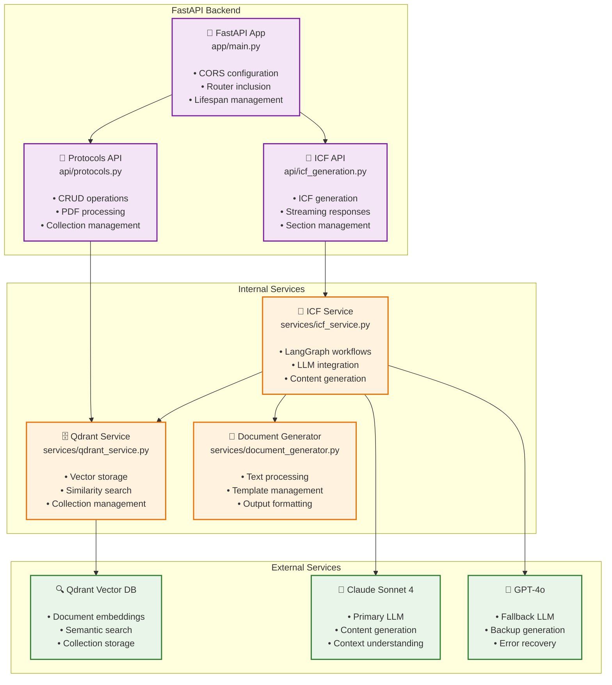

# Backend Services Architecture

This diagram shows the backend FastAPI services and their internal connections.

## Service Responsibilities

### 🚀 FastAPI App (`app/main.py`)
- **Application Bootstrap**: CORS, routing, lifecycle management
- **Health Endpoints**: Root and health check endpoints
- **Router Integration**: Includes protocol and ICF routers
- **Error Handling**: Global exception handling

**Endpoints:**
- `GET /` - Root health check
- `GET /api/health` - Dedicated health endpoint

### 📄 Protocols API (`api/protocols.py`)
- **Protocol CRUD**: Create, read, update, delete protocols
- **PDF Processing**: Text extraction with PyMuPDF
- **Text Chunking**: RecursiveCharacterTextSplitter integration
- **Collection Management**: Qdrant collection lifecycle

**Endpoints:**
- `POST /api/protocols/` - Create protocol
- `POST /api/protocols/upload` - Upload PDF
- `GET /api/protocols/` - List protocols
- `GET /api/protocols/{id}` - Get protocol
- `GET /api/protocols/collection/{name}` - Get by collection
- `PATCH /api/protocols/{id}/status` - Update status
- `DELETE /api/protocols/{id}` - Delete protocol

### 🧾 ICF API (`api/icf_generation.py`)
- **ICF Generation**: Complete and streaming generation
- **Section Management**: Individual section operations
- **Status Tracking**: Generation task monitoring
- **Error Recovery**: Section-level error handling

**Endpoints:**
- `POST /api/icf/generate` - Generate complete ICF
- `POST /api/icf/generate-stream` - Streaming generation
- `POST /api/icf/regenerate-section` - Regenerate section
- `GET /api/icf/protocol/{name}/summary` - Protocol summary
- `GET /api/icf/status/{task_id}` - Generation status
- `GET /api/icf/sections/requirements` - Section requirements
- `GET /api/icf/health` - ICF service health

### 🗄️ Qdrant Service (`services/qdrant_service.py`)
- **Vector Operations**: Embedding storage and retrieval
- **Collection Management**: Create, update, delete collections
- **Similarity Search**: Context retrieval for generation
- **Protocol Metadata**: Structured data storage

### 🤖 ICF Service (`services/icf_service.py`)
- **LangGraph Workflows**: Parallel section generation
- **LLM Integration**: Claude/GPT-4 orchestration
- **Context Assembly**: RAG implementation
- **Streaming Management**: Real-time response handling

### 📝 Document Generator (`services/document_generator.py`)
- **Template Processing**: ICF section templates
- **Content Formatting**: Output standardization
- **Quality Control**: Content validation
- **Error Management**: Generation error handling

## Technology Stack

### Core Framework
- **FastAPI**: Modern Python web framework
- **Pydantic**: Data validation and serialization
- **Uvicorn**: ASGI server for production

### AI & ML
- **LangGraph**: AI workflow orchestration
- **LangChain**: LLM integration framework
- **Anthropic Claude**: Primary language model
- **OpenAI GPT-4**: Fallback language model

### Data Storage
- **Qdrant**: Vector database for embeddings
- **PyMuPDF**: PDF text extraction
- **RecursiveCharacterTextSplitter**: Text chunking

## Print Guidelines

- **Page Size**: Optimized for standard 8.5x11" paper
- **Orientation**: Portrait recommended
- **Scale**: Diagram fits comfortably on one page
- **Colors**: Service types color-coded for clarity 