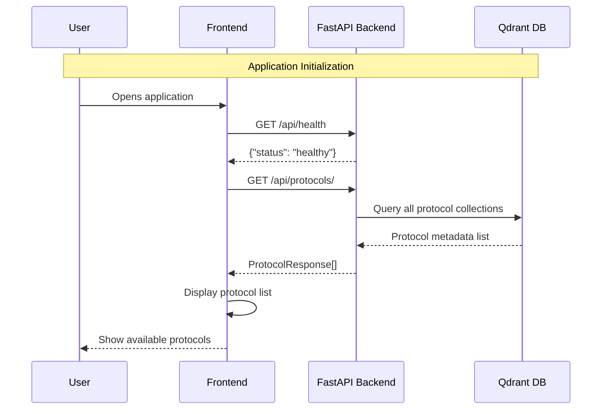
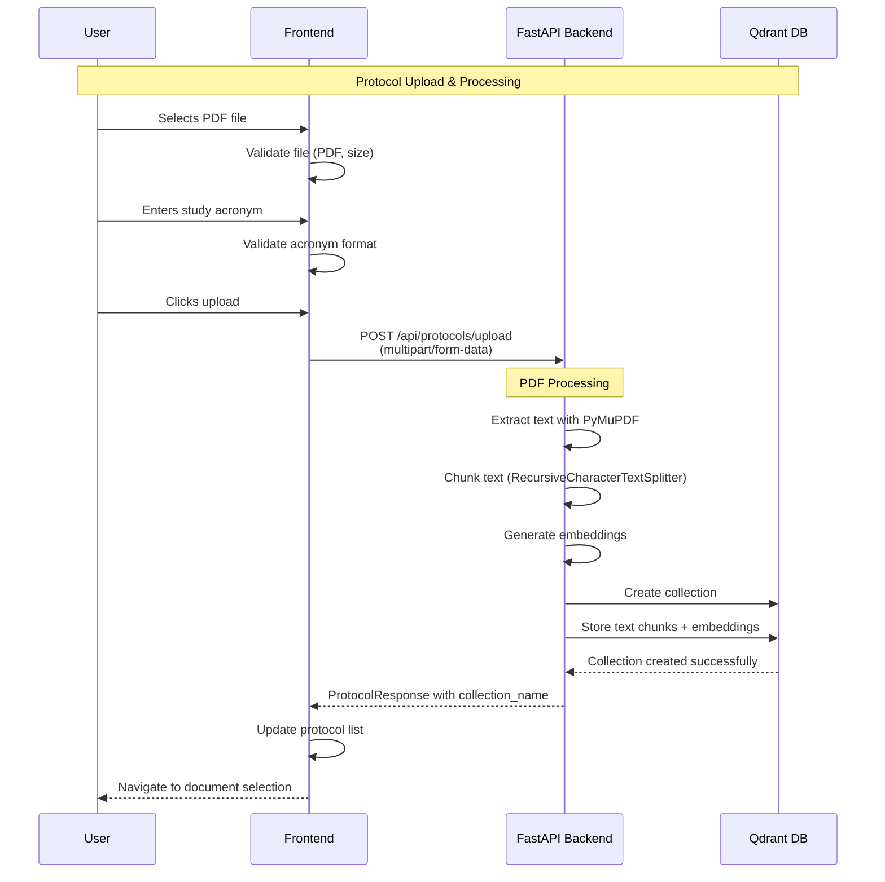
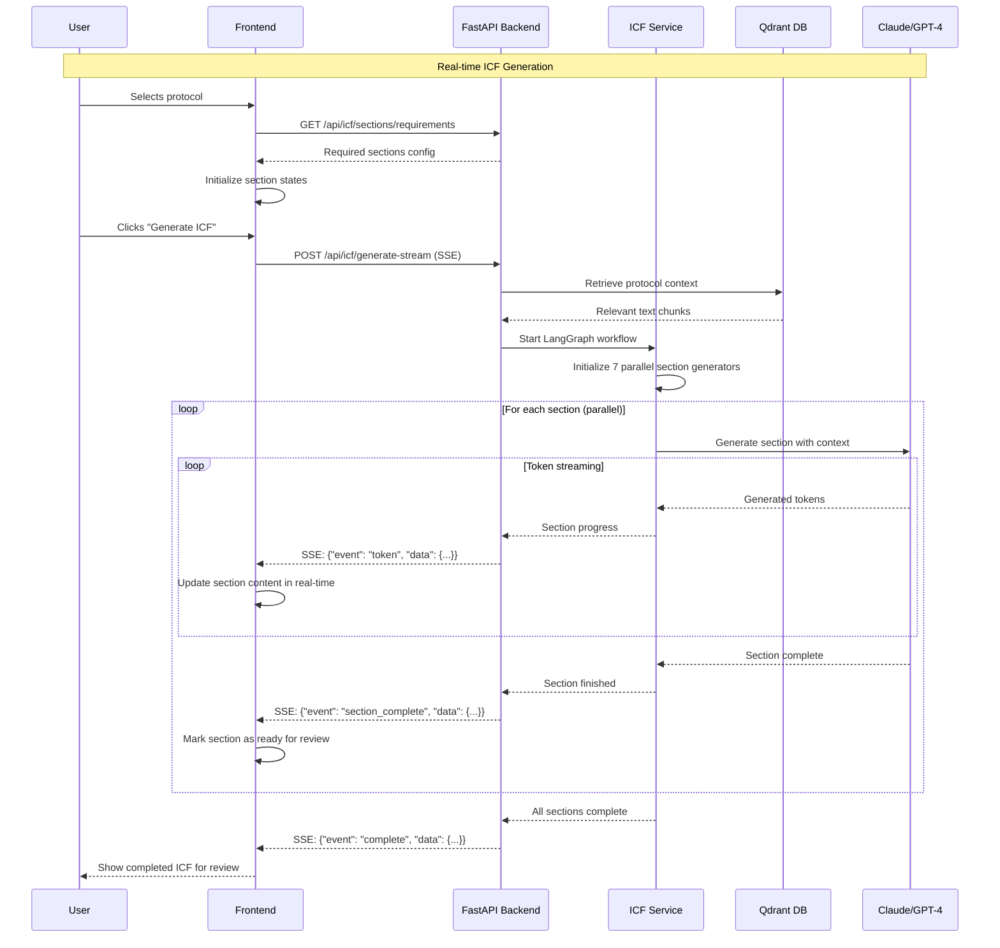
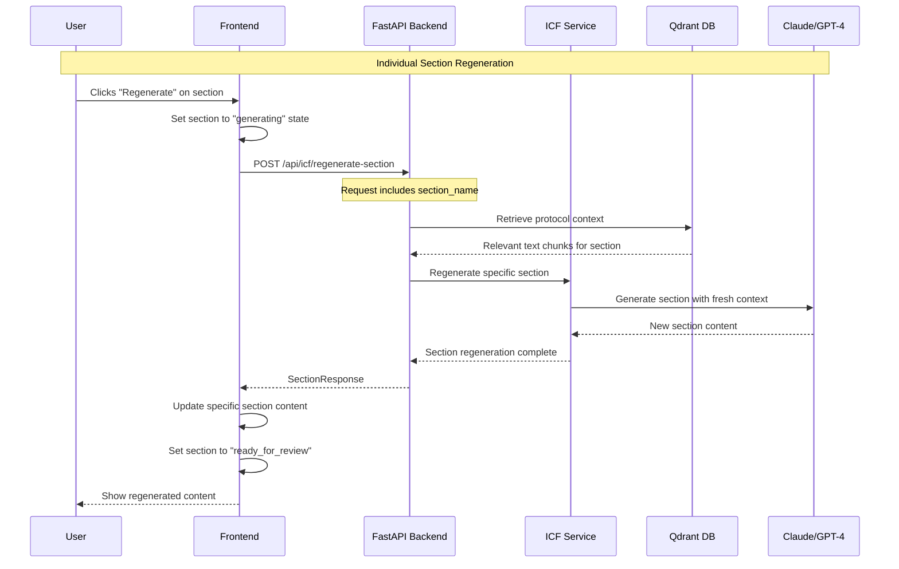
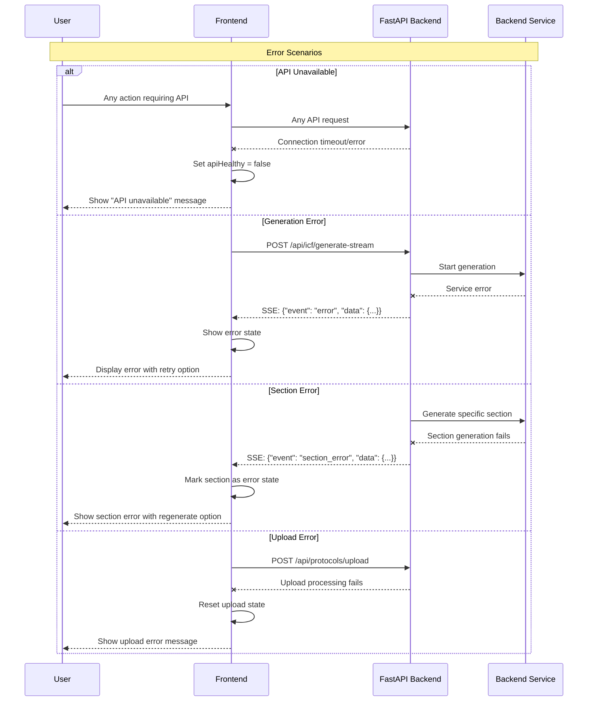

# Data Flow Sequences

Complete sequence diagrams showing the data flow for each major workflow in the Clinical Trial Accelerator.

---

## 🚀 Application Startup Flow

**Key Steps:**
1. User opens the application
2. Frontend checks backend health
3. Frontend loads all available protocols
4. UI displays protocol selection interface

**Error Handling:**
- If health check fails → Show "API unavailable" message
- If protocol loading fails → Show empty state with upload option

---

## 📤 Protocol Upload Flow

**Key Steps:**
1. File validation (PDF format, size limits)
2. Acronym validation (2-20 chars, alphanumeric)
3. PDF text extraction using PyMuPDF
4. Text chunking for optimal embedding
5. Vector storage in Qdrant
6. Protocol metadata creation

**Progress Tracking:**
- Frontend shows upload progress (0-100%)
- Real-time feedback during processing
- Error messages for validation failures

---

## 🧾 ICF Generation Flow (Streaming)

**Key Features:**
- **Parallel Processing**: All 7 sections generate simultaneously
- **Real-time Updates**: Token-by-token content streaming
- **Progress Tracking**: Visual feedback for each section
- **Error Recovery**: Section-level error handling

**Section Types Generated:**
1. Summary - Study overview
2. Background - Medical rationale
3. Participants - Eligibility criteria
4. Procedures - Study timeline
5. Alternatives - Treatment options
6. Risks - Potential side effects
7. Benefits - Expected outcomes

---

## 🔄 Section Regeneration Flow

**Use Cases:**
- User unsatisfied with generated content
- Need different tone or focus
- Error recovery for failed sections
- Iterative content refinement

**Benefits:**
- No need to regenerate entire ICF
- Preserves approved sections
- Fast turnaround for improvements
- Maintains workflow continuity

---

## 🚨 Error Handling Flows

**Error Recovery Strategies:**
- **Graceful Degradation**: Continue with available functionality
- **User Feedback**: Clear error messages with actionable steps
- **Retry Mechanisms**: Allow users to retry failed operations
- **Partial Success**: Handle section-level failures independently

---

## 📊 Performance Characteristics

### Typical Response Times
- **Health Check**: < 100ms
- **Protocol List**: < 500ms
- **File Upload**: 2-10 seconds (depends on file size)
- **ICF Generation**: 30-120 seconds (streaming)
- **Section Regeneration**: 10-30 seconds

### Concurrent Operations
- **Multiple Sections**: Generated in parallel
- **Real-time Streaming**: Token-by-token updates
- **Background Processing**: PDF text extraction
- **Error Isolation**: Section failures don't affect others

---

## 🔗 Integration Points

### Frontend State Management
- **Real-time Updates**: SSE event handling
- **Progress Tracking**: Visual feedback systems
- **Error States**: Component-level error boundaries
- **Session Persistence**: localStorage for protocol selection

### Backend Orchestration
- **LangGraph Workflows**: AI pipeline management
- **Vector Search**: Context retrieval optimization
- **Streaming Responses**: Server-Sent Events implementation
- **Error Recovery**: Service-level exception handling

---

## 📋 Print Guidelines

- **Page Size**: Each sequence fits on standard 8.5x11" paper
- **Orientation**: Portrait recommended
- **Sections**: Organized by workflow type
- **Detail Level**: Sufficient for debugging and development
- **Cross-Reference**: Links to related API endpoints 