# System Overview - Clinical Trial Accelerator

High-level architecture diagram showing the complete system with all major components and their interactions.

```mermaid
graph TB
    %% User Layer
    subgraph "User Interface"
        User["👤 Clinical Researcher<br/><br/>• Upload protocols<br/>• Generate ICF documents<br/>• Review and approve content"]
    end

    %% Frontend Layer
    subgraph "Frontend - Next.js Application"
        HomePage["🏠 Protocol Selection<br/>app/page.tsx"]
        UploadPage["📤 Protocol Upload<br/>components/ProtocolUpload.tsx"]
        ICFPage["🧾 ICF Generation<br/>components/icf/ICFGenerationDashboard.tsx"]
        
        HomePage -.-> UploadPage
        HomePage -.-> ICFPage
    end

    %% API Layer
    subgraph "Backend - FastAPI Application"
        MainRouter["🚀 Main Application<br/>app/main.py<br/><br/>• CORS configuration<br/>• Health endpoints<br/>• Router management"]
        
        ProtocolRouter["📄 Protocol Router<br/>api/protocols.py<br/><br/>• CRUD operations<br/>• PDF processing<br/>• File upload handling"]
        
        ICFRouter["🧾 ICF Router<br/>api/icf_generation.py<br/><br/>• Document generation<br/>• Streaming responses<br/>• Section management"]
    end

    %% Service Layer
    subgraph "Business Logic Services"
        QdrantSvc["🗄️ Qdrant Service<br/>services/qdrant_service.py<br/><br/>• Vector operations<br/>• Collection management<br/>• Similarity search"]
        
        ICFSvc["🤖 ICF Service<br/>services/icf_service.py<br/><br/>• LangGraph workflows<br/>• LLM orchestration<br/>• Content generation"]
        
        DocGen["📝 Document Generator<br/>services/document_generator.py<br/><br/>• Template processing<br/>• Content formatting<br/>• Quality control"]
    end

    %% Data Layer
    subgraph "Data Storage & AI"
        VectorDB["🔍 Qdrant Vector Database<br/><br/>• Protocol embeddings<br/>• Semantic search<br/>• Document chunks<br/>• Metadata storage"]
        
        PrimaryLLM["🧠 Claude Sonnet 4<br/><br/>• Primary AI model<br/>• Content generation<br/>• Context understanding<br/>• High-quality output"]
        
        FallbackLLM["🤖 GPT-4o<br/><br/>• Fallback AI model<br/>• Error recovery<br/>• Load balancing<br/>• Redundancy"]
    end

    %% User Interactions
    User --> HomePage
    User --> UploadPage
    User --> ICFPage

    %% Frontend to Backend
    HomePage -->|"Health checks<br/>Protocol listing"| MainRouter
    UploadPage -->|"PDF upload<br/>Processing status"| ProtocolRouter
    ICFPage -->|"ICF generation<br/>Section management"| ICFRouter

    %% Backend Routing
    MainRouter --> ProtocolRouter
    MainRouter --> ICFRouter

    %% Service Connections
    ProtocolRouter --> QdrantSvc
    ICFRouter --> ICFSvc
    ICFSvc --> QdrantSvc
    ICFSvc --> DocGen

    %% Data Connections
    QdrantSvc --> VectorDB
    ICFSvc --> PrimaryLLM
    ICFSvc --> FallbackLLM

    %% Styling
    classDef user fill:#fff2cc,stroke:#d6b656,stroke-width:3px
    classDef frontend fill:#e1f5fe,stroke:#0277bd,stroke-width:2px
    classDef backend fill:#f3e5f5,stroke:#7b1fa2,stroke-width:2px
    classDef service fill:#fff3e0,stroke:#ef6c00,stroke-width:2px
    classDef data fill:#e8f5e8,stroke:#2e7d32,stroke-width:2px

    class User user
    class HomePage,UploadPage,ICFPage frontend
    class MainRouter,ProtocolRouter,ICFRouter backend
    class QdrantSvc,ICFSvc,DocGen service
    class VectorDB,PrimaryLLM,FallbackLLM data
```



---

## 🏗️ Architecture Layers

### 👤 User Interface Layer
**Purpose**: Clinical researcher interaction  
**Components**: Web browser interface  
**Responsibilities**:
- Protocol selection and management
- Document upload and processing
- ICF review and approval
- Error handling and feedback

### 🖥️ Frontend Application Layer
**Technology**: Next.js 15 + React 19 + TypeScript  
**Components**: 3 main pages/components  
**Responsibilities**:
- User interface rendering
- API communication
- State management
- Real-time updates (SSE)
- Client-side validation

### 🔌 API Gateway Layer
**Technology**: FastAPI + Uvicorn  
**Components**: Main app + 2 routers  
**Responsibilities**:
- HTTP request routing
- CORS configuration
- Request/response validation
- Error handling
- Health monitoring

### ⚙️ Business Logic Layer
**Technology**: Python services + LangGraph  
**Components**: 3 specialized services  
**Responsibilities**:
- Protocol processing
- AI workflow orchestration
- Document generation
- Vector operations
- Content validation

### 💾 Data & AI Layer
**Technology**: Qdrant + Claude + GPT-4  
**Components**: Vector DB + 2 LLMs  
**Responsibilities**:
- Document storage and retrieval
- Semantic search
- AI content generation
- Context understanding
- Fallback processing

---

## 🔄 Data Flow Summary

### 1. Protocol Upload Flow
```
User → Upload Component → Protocol Router → Qdrant Service → Vector DB
```
- PDF text extraction
- Content chunking
- Embedding generation
- Metadata storage

### 2. ICF Generation Flow
```
User → ICF Component → ICF Router → ICF Service → LLM + Vector DB
```
- Context retrieval
- Parallel section generation
- Real-time streaming
- Content validation

### 3. Health & Status Flow
```
Frontend → Main Router → Health Response
Frontend → Protocol Router → Status Updates
```
- API availability checking
- System status monitoring
- Error state management

---

## 🛠️ Technology Stack

### Frontend Technologies
- **Next.js 15**: React framework with App Router
- **React 19**: Component library with hooks
- **TypeScript**: Type safety and development experience
- **Tailwind CSS**: Utility-first styling
- **Server-Sent Events**: Real-time streaming

### Backend Technologies
- **FastAPI**: Modern Python web framework
- **Pydantic**: Data validation and serialization
- **Uvicorn**: ASGI server for production
- **LangGraph**: AI workflow orchestration
- **LangChain**: LLM integration framework

### AI & Data Technologies
- **Qdrant**: Vector database for embeddings
- **Claude Sonnet 4**: Primary language model
- **OpenAI GPT-4o**: Fallback language model
- **PyMuPDF**: PDF text extraction
- **RecursiveCharacterTextSplitter**: Text chunking

---

## 📊 System Characteristics

### Performance Metrics
- **Concurrent Users**: Designed for 10-50 simultaneous users
- **File Processing**: 1-10MB PDFs in 2-10 seconds
- **ICF Generation**: 7 sections in 30-120 seconds
- **Real-time Updates**: Token-by-token streaming
- **API Response**: < 500ms for most endpoints

### Scalability Features
- **Parallel Processing**: Multiple sections generated simultaneously
- **Vector Search**: Optimized similarity search
- **Streaming Responses**: Reduced perceived latency
- **Error Recovery**: Section-level failure isolation
- **Load Balancing**: Primary/fallback LLM configuration

### Security & Reliability
- **CORS Protection**: Configured for specific origins
- **Input Validation**: Pydantic models for all requests
- **Error Handling**: Graceful degradation patterns
- **Health Monitoring**: Multiple health check endpoints
- **Data Persistence**: Vector database for protocol storage

---

## 🎯 Key Features

### ✅ Implemented (First MVP)
- **Protocol Upload**: PDF processing and storage
- **ICF Generation**: 7-section document creation
- **Real-time Streaming**: Token-by-token updates
- **Section Management**: Individual section regeneration
- **Error Recovery**: Graceful failure handling
- **Health Monitoring**: API status checking

### 🔄 Future Enhancements (Phase 2)
- **Site Checklist Generation**: Additional document type
- **PDF Export**: Download generated documents
- **User Authentication**: Multi-user support
- **Template Customization**: Configurable document formats
- **Audit Logging**: Change tracking and history
- **Batch Processing**: Multiple protocol handling

---

## 📋 Print Guidelines

- **Page Size**: Optimized for standard 8.5x11" paper
- **Orientation**: Portrait recommended for text, Landscape for diagram
- **Sections**: Organized by architectural layer
- **Detail Level**: High-level overview suitable for stakeholders
- **Color Coding**: Each layer has distinct colors for clarity

---

## 🔗 Related Documentation

- **[Frontend API Usage](../frontend-api-usage.md)**: Detailed API integration
- **[Backend API Routes](../backend-api-routes.md)**: Complete endpoint reference
- **[Project PRD](../prd.md)**: Product requirements and specifications
- **[Technical Architecture](../architecture.md)**: Detailed technical design
- **[Deployment Checklist](../deployment-checklist.md)**: Production deployment guide 